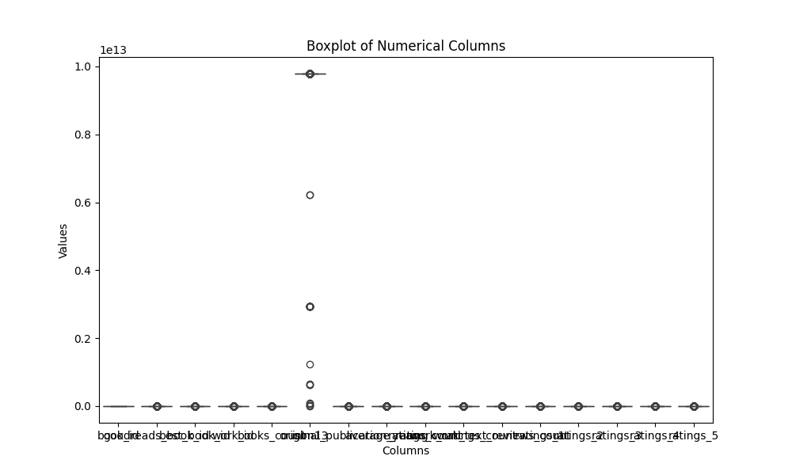

# Analysis Report

## Story

### Story Summary of the Goodreads Dataset

In this analysis, we delve into a dataset from Goodreads comprising 10,000 book entries that shed light on various aspects of the books, including their ratings, publication details, and authorship. This dataset serves as a valuable resource for understanding reader engagement and preferences within the Goodreads community.

#### Dataset Overview

The dataset consists of several columns, notably:
- **Identifiers**: `book_id`, `goodreads_book_id`, `best_book_id`, `work_id`.
- **Book Details**: `isbn`, `isbn13`, `authors`, `original_publication_year`, `original_title`, `title`, `language_code`.
- **Ratings and Reviews**: `average_rating`, `ratings_count`, `work_ratings_count`, `work_text_reviews_count`, and detailed breakdowns of ratings from 1 to 5.
- **Images**: `image_url`, `small_image_url`.

The dataset is diverse, with 4,664 unique titles authored by a variety of writers, including a notable number of works by Stephen King, which appears as the most frequently cited author.

#### Key Findings

1. **Publication Years**: The dataset contains books published as far back as 1750, with a notable trend towards more recent publications—most entries fall between 2000 and 2017, indicating a modern readership focus.

2. **Rating Trends**: The average rating across the dataset is approximately 4.00, suggesting a generally favorable reception of the books. However, there is a significant skew towards the lower ratings (1 to 3), indicating that while many books receive high ratings, a substantial number of readers may feel less satisfied.

3. **Ratings Distribution**: The majority of ratings are concentrated in the 3 to 5 star range, with the 5-star rating being the most frequently awarded. The distribution of ratings shows that some books receive extraordinarily high counts of lower ratings (1 and 2 stars), signaling polarizing opinions, which may warrant a closer examination of these titles.

4. **Authors and Popularity**: A small subset of authors dominates the dataset, with the top authors garnering a majority of the ratings and reviews. This suggests a potential opportunity for emerging authors to gain visibility by leveraging community engagement strategies, such as reading challenges or promotional events.

5. **Missing Values**: The dataset has several missing values, particularly in the `isbn`, `isbn13`, `original_publication

## Visualizations

