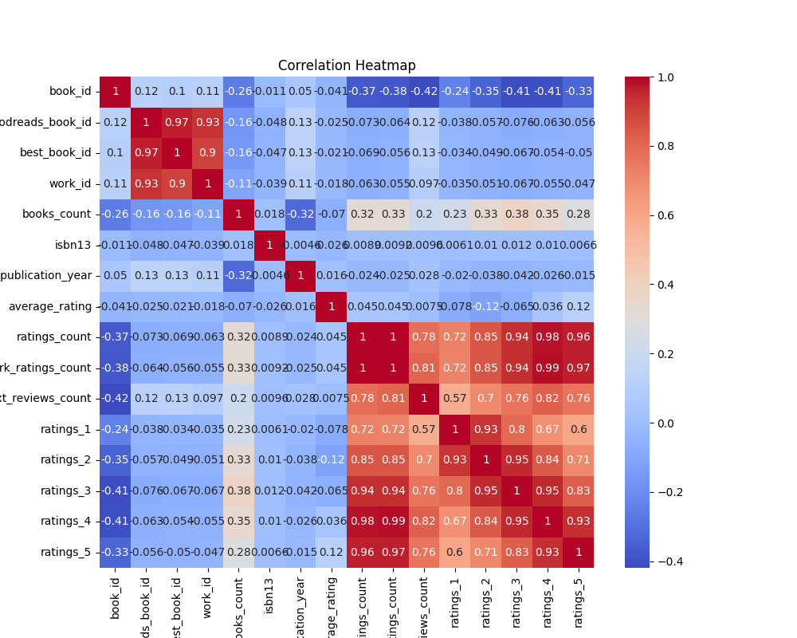
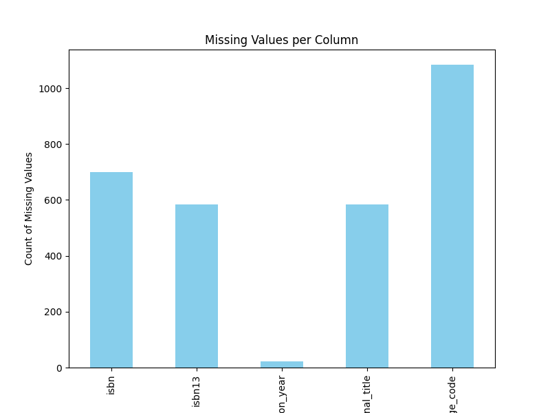
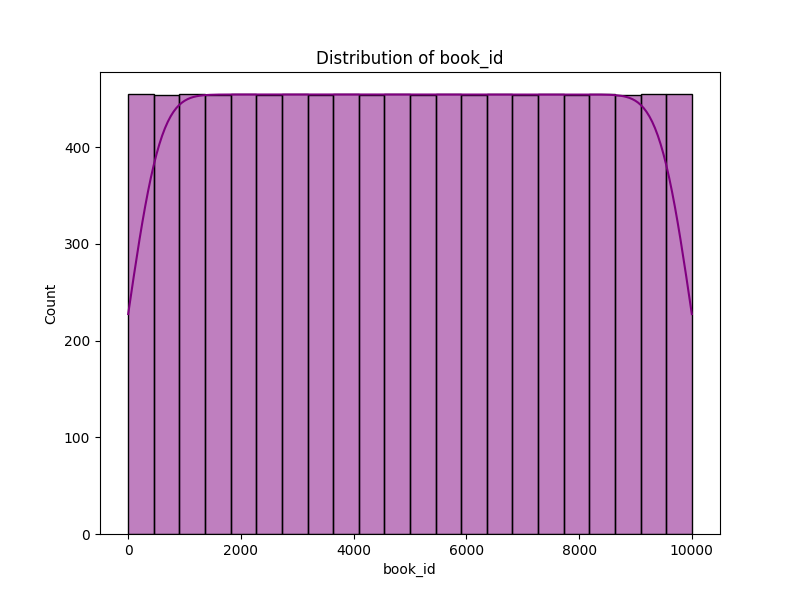

# Analysis Report

## Story

### Story Summary of the Goodreads Dataset

The dataset comprises 10,000 book entries from Goodreads, a widely used platform for readers to share and review books. This dataset provides a wealth of information on various attributes of the books, including their IDs, authors, publication years, average ratings, and counts of different ratings.

#### Key Findings

1. **Author Representation**:
   - The dataset features books from a diverse array of authors, with Stephen King being the most frequently represented, appearing in 60 entries. This suggests a significant interest in his works among Goodreads users.

2. **Publication Years**:
   - The books span a vast time frame, with the earliest original publication year recorded as 1750 and the most recent as 2017. This indicates a wide variety of genres and literary styles, appealing to different reader preferences.

3. **Average Ratings and Ratings Distribution**:
   - The average rating across the dataset is approximately 4.00, suggesting that users generally rate books positively. However, the ratings distribution reveals a significant number of low ratings, particularly for the lower tiers (ratings of 1 and 2), which could indicate polarized opinions about certain books.
   - The dataset identifies a notable correlation between the number of ratings (ratings_count) and the average ratings. Books with more ratings tend to have a more stable average rating.

4. **Missing Values**:
   - There are notable missing values, particularly in the ISBN (700 entries), original publication year (21 entries), and language code (1084 entries). This could affect analyses based on these parameters and suggests that data cleaning and imputation might be necessary for deeper insights.

5. **Outliers**:
   - The dataset contains several outliers in terms of ratings, particularly for the counts of 1-star to 5-star ratings. Some entries show extraordinarily high numbers, which may indicate either highly popular books or potential data entry errors.

6. **Correlation Analysis**:
   - The correlation matrix reveals some interesting relationships. For instance, there is a strong positive correlation between `work_ratings_count` and `ratings_count` (0.995068), indicating that books with more ratings also receive more ratings in general. Conversely, `average_rating` displays a weak negative correlation with `ratings_count`, suggesting that books with many ratings do not always maintain high average ratings.

#### Actionable Insights

1. **Focus on Popular Authors**:
   - Publishers and marketers can capitalize on the popularity of

## Visualizations

