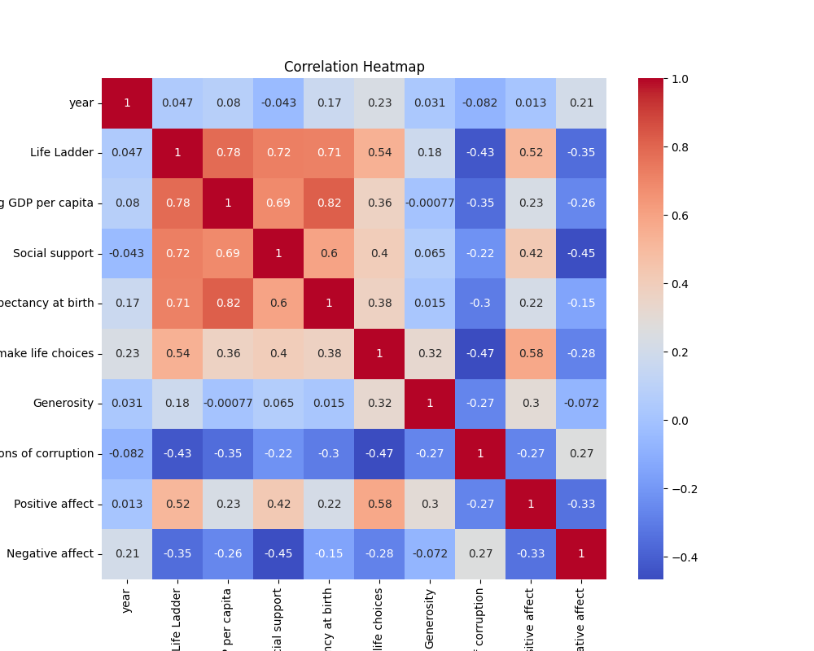
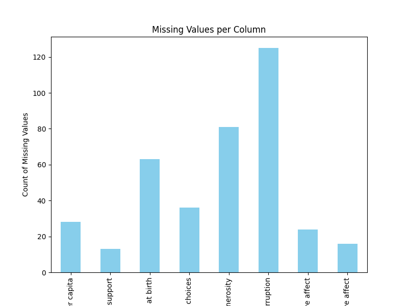
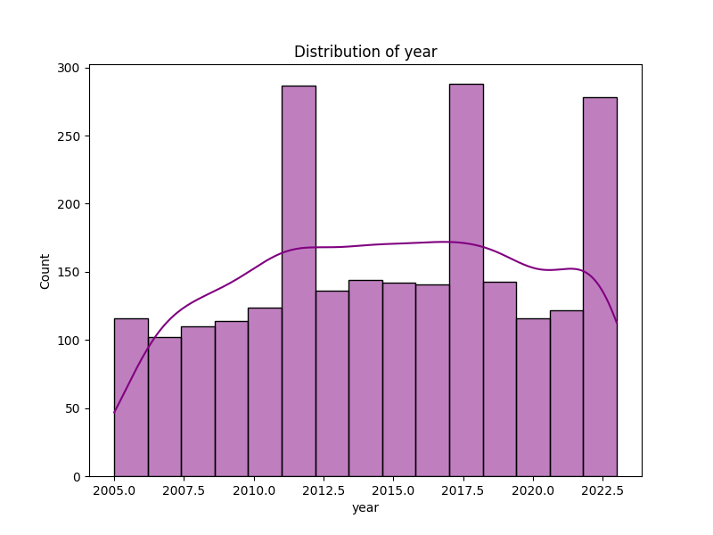
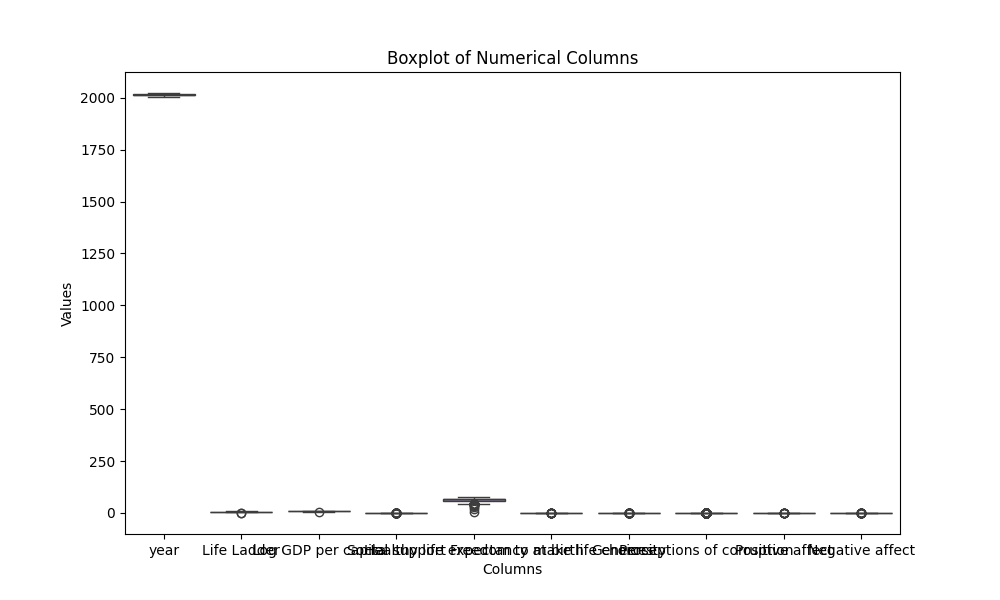

# Analysis Report

## Story

### Insights into the Dataset Analysis

#### Unexpected Correlations

1. **Life Ladder and Log GDP per Capita**: The correlation coefficient of **0.783** indicates a strong positive relationship, which is expected as higher incomes often lead to better well-being. However, it’s notable that this is not a perfect correlation, hinting that GDP alone does not fully explain happiness.

2. **Social Support and Life Ladder**: The correlation of **0.723** suggests that social connections significantly impact happiness. This emphasizes the importance of community and relationships over purely economic factors.

3. **Perceptions of Corruption and Life Ladder**: There is a negative correlation of **-0.430** between these two variables. This suggests that higher corruption perceptions are associated with lower happiness, which aligns with the idea that trust in institutions is crucial for well-being.

4. **Negative Affect and Life Ladder**: The correlation of **-0.352** highlights that as negative emotions increase, happiness tends to decrease, reinforcing the notion that emotional well-being is a key component of overall happiness.

5. **Freedom to Make Life Choices and Positive Affect**: The correlation of **0.578** underscores the relationship between personal autonomy and happiness. This suggests that individuals who feel they have more control over their lives tend to experience more positive emotions.

#### PCA Results

The PCA results indicate that the first two principal components explain a substantial portion of the variance in the data:

- **First Component (68.3%)**: Likely captures the combined effects of economic factors (e.g., GDP) and social factors (e.g., social support).
- **Second Component (30.3%)**: Possibly relates to emotional well-being and perceptions of life choices, as it may incorporate aspects like positive and negative affect.

This suggests that the dataset has a strong underlying structure where economic and social dimensions of happiness are prominent.

#### Clustering Patterns

The Silhouette Score of **0.397** indicates that there is some separation between clusters but not very strong. This suggests that while some clustering exists, the data may not form well-defined groups. 

### Strategies for Improving Data Quality and Modeling

1. **Address Missing Values**: 
   - **Imputation**: Use techniques like mean/mode imputation, k-nearest neighbors, or more advanced methods like Multiple Imputation to handle missing values in variables such as `Log GDP per capita`, `Freedom to make life choices`, and `Generosity`.
   - **Analysis of Missingness**: Investigate if the missing values are random or if there's a pattern that could provide insights.

2. **Outlier Detection**:
   - Even though no outliers were detected, it's good practice to regularly assess data for outliers that may arise in future data collection.

3. **Feature Engineering**:
   - Create new features or transform existing ones to capture non-linear relationships. For instance, interaction terms between `Log GDP per capita`

## Visualizations
### Correlation Heatmap

### Missing Values

### Distribution

### Boxplot

