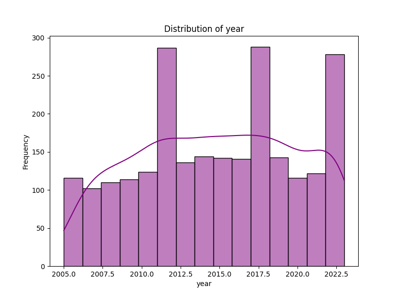

# Analysis Report

## Story

### Story Summary of Happiness Dataset

In a comprehensive analysis of happiness across different countries and years, we explored an extensive dataset capturing various factors that contribute to an individual's sense of well-being. The dataset consists of **2,363 entries** spanning multiple years, with a focus on key indicators such as life ladder scores, GDP per capita, social support, and perceptions of corruption, among others.

#### Key Findings

1. **Demographics and Missing Values**:
   - The dataset includes **165 unique countries**. However, there are some missing values across different indicators, notably in *Generosity* (81 missing), *Perceptions of corruption* (125 missing), and *Healthy life expectancy at birth* (63 missing). Addressing these missing values could enhance the robustness of future analyses.

2. **Statistical Insights**:
   - The average *Life Ladder* score, which reflects subjective well-being, is approximately **5.48** with a standard deviation of **1.13**, indicating a spread of happiness levels across countries. The highest recorded score is **8.02**, while the lowest is **1.28**.
   - The mean *Log GDP per capita* stands at **9.40**, suggesting a positive correlation between income and happiness. This aligns with the common understanding that wealthier nations tend to have higher happiness levels.

3. **Relationships Among Variables**:
   - A strong correlation exists between *Life Ladder* and *Log GDP per capita* (**0.78**), suggesting that as income increases, so does perceived happiness.
   - *Social support* and *Healthy life expectancy at birth* also show significant positive correlations with *Life Ladder*, with coefficients of **0.72** and **0.71**, respectively. This highlights the importance of community and health in fostering happiness.
   - Interestingly, *Perceptions of corruption* negatively correlate with *Life Ladder* (**-0.43**), indicating that higher corruption perceptions are associated with lower happiness levels.

4. **Skewness in Data**:
   - The skewness values indicate that variables such as *Social support* and *Healthy life expectancy at birth* are negatively skewed, suggesting a higher frequency of lower values, while *Generosity* and *Negative affect* are positively skewed, indicating a tendency towards higher values for these variables.

5. **Emotional Factors**:
   - The dataset also includes emotional components, revealing that *Positive affect* (mean of

## Visualizations

