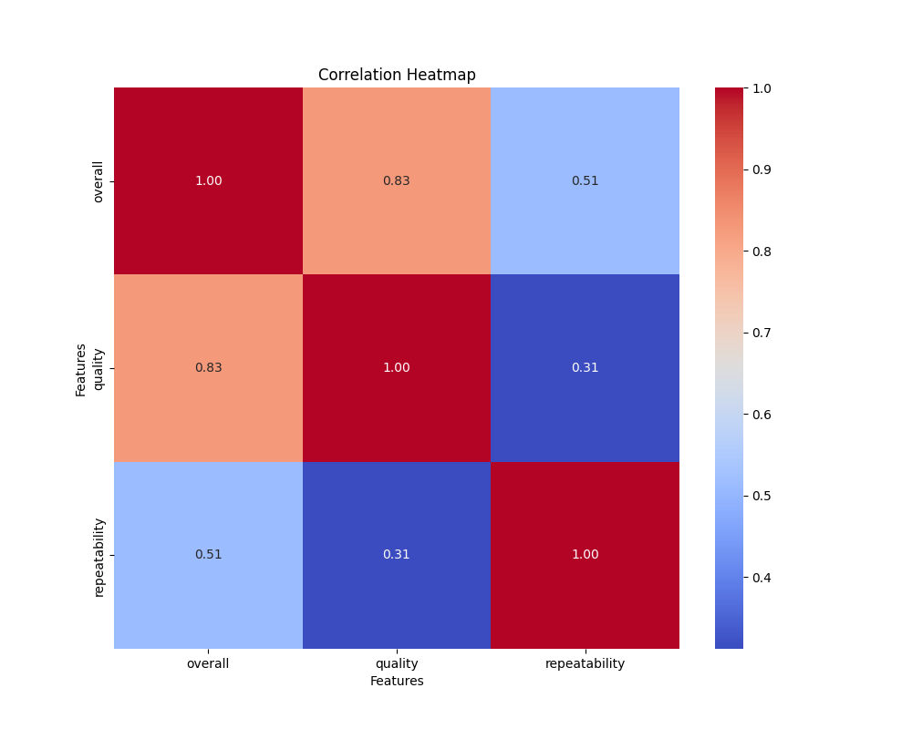
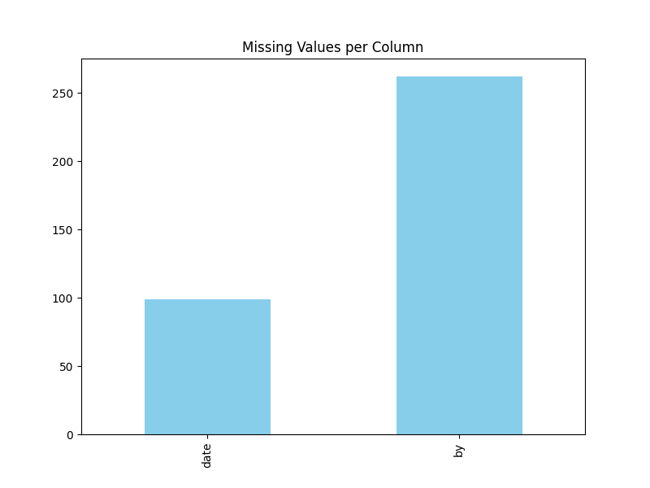
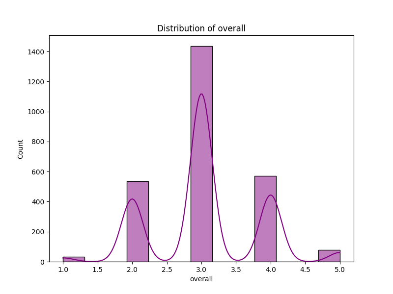
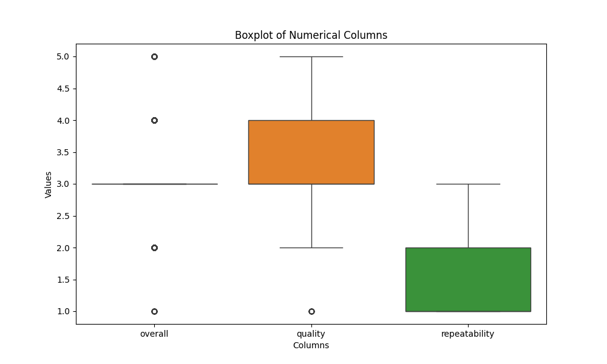

# Analysis Report

## Story

### Dataset Summary and Insights on Media Evaluation

#### Overview
The dataset under analysis comprises 2,652 entries related to various media items, including movies, TV shows, and possibly other formats. Each entry is characterized by several attributes, including the date of entry, language, type of media, title, creator, and scores for overall quality, specific quality aspects, and repeatability. This analysis aims to extract meaningful insights from the dataset to understand media performance better.

#### Key Findings

1. **Data Composition**:
   - The dataset spans a variety of media types, with a notable frequency of entries for movies (2,211 instances) and a dominant language being English (1,306 entries).
   - The dataset contains 2,553 unique dates, indicating a wide range of media entries over time.

2. **Missing Values**:
   - A total of 99 entries have missing values in the "date" column, and 262 entries have missing values in the "by" column (creator). This may indicate potential gaps in data collection or reporting.
   - Importantly, the other columns, including overall, quality, and repeatability scores, do not have missing values, ensuring that the analysis of these metrics is robust.

3. **Summary Statistics**:
   - The mean overall score is approximately 3.05, with scores ranging from a minimum of 1 to a maximum of 5. This suggests that most media items tend to be rated fairly positively.
   - The quality metric has a mean score of about 3.21, indicating general satisfaction with the media items' quality.
   - The repeatability score has a mean of 1.49, suggesting that media items are often not rewatched or revisited, which could prompt further investigation into user engagement.

4. **Outliers**:
   - While specific outlier analysis data is not fully detailed, the presence of NaN values alongside scores for "overall," "quality," and "repeatability" suggests that certain media may have been evaluated inconsistently or lack sufficient data for a robust qualitative assessment.

5. **Skewness and Distribution**:
   - The skewness of scores indicates that the distribution of overall (0.155) and quality (0.024) scores is relatively symmetrical, while the repeatability score shows a significant positive skew (0.777), suggesting that most media items are rated low on repeatability.
   - This could imply that while media quality is

## Visualizations

